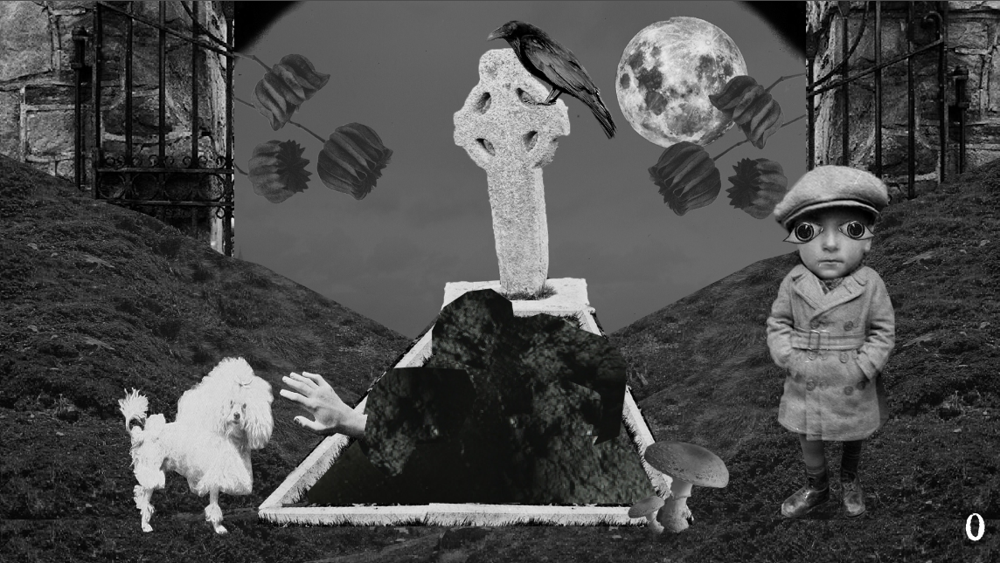

# Trijam_Bruxelles

This game was made within 3 hours, during the trijam challenge in Bruxelles.

The purpose of the game is to feed the dog by eating the hand out of the grave.
But be careful, if the crow or the child detect you, it is finished

